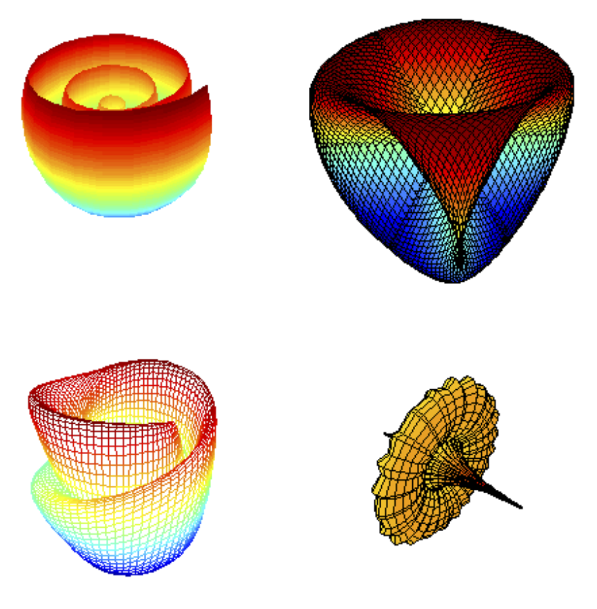
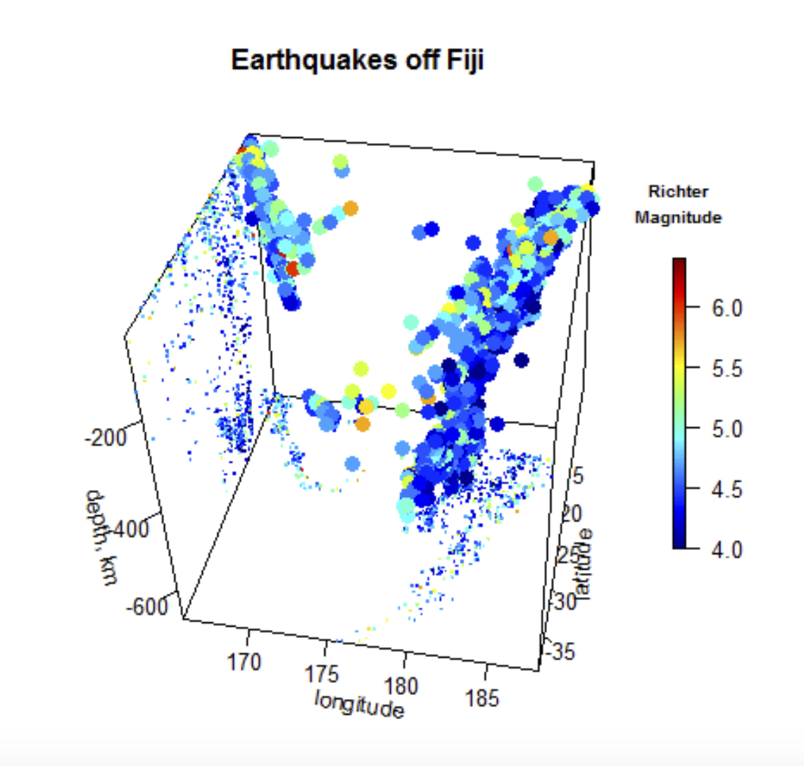

```{r setup, include=FALSE}
knitr::opts_chunk$set(echo = FALSE)
```

## Dr. Karline Soetaert   
### Senior Scientist at the Royal Netherlands Institute for Sea Research                       
- Estuarine and Delta Systems  
### 23 software packages
  - Aquatic chemistry and calculus 
  - https://www.rdocumentation.org/collaborators/name/Karline%20Soetaert
  - https://github.com/karlines
  
  {width=150px}

## What can it do?
- Plots 2-D and 3-D data
- An extension of R’s persp, image and contour functions
- Plots x,y,z and additional data represented by color
- Increase figure resolution

{width=300px}


## Why is it useful?
- Allows you to communicate 4 separate data dimensions (x, y,  z, color)
- Easier to visualize spatial relationships
- Exciting visuals
- In my opinion, best for creating maps (scatter, line, and bar plots look too busy) 

{width=300p}

## persp3D()

```{r, echo = TRUE}
library(plot3D)
data(volcano)

##simple example persp3D
par(mfrow = c(1, 1))
persp3D(z = volcano, main = "volcano", clab = c("height", "m"))

```

## Compared to persp()

```{r, echo=T}
persp(z = volcano, main = "volcano")
```

## contour3D()
```{r, echo=T}
contour3D(z = volcano, colvar = volcano, lwd = 2, 
          nlevels = 20, clab = c("height", "m"), colkey = FALSE)
```

## contour3D() with persp3D()
```{r, echo=TRUE}
persp3D(z = volcano, col = "white", shade = 0.1, plot = FALSE)
contour3D(z = volcano, colvar = volcano, lwd = 1, 
  add = TRUE, dDepth = 0.5)
```

## Compared to contour()
```{r, echo=TRUE}
contour(z = volcano, lwd = 2, 
        nlevels = 20)
```

## If you mess with the different settings...
```{r, echo=T}
persp3D(z = volcano, zlim = c(-60, 200), phi = 20,
        colkey = list(length = 0.2, width = 0.4, shift = 0.15,
                      cex.axis = 0.8, cex.clab = 0.85), lighting = TRUE, 
        lphi = 90,
        clab = c("","height","m"), bty = "f", plot = FALSE)
# create gradient in x-direction
Vx <- volcano[-1, ] - volcano[-nrow(volcano), ]

```

## you can make very fancy maps!
```{r, echo=T}
# add as image with own color key, at bottom
image3D(z = -60, colvar = Vx/10, add = TRUE,
        colkey = list(length = 0.2, width = 0.4, shift = -0.15,
                      cex.axis = 0.8, cex.clab = 0.85),
        clab = c("","gradient","m/m"), plot = FALSE)
# add contour
contour3D(z = -60+0.01, colvar = Vx/10, add = TRUE,
          col = "black", plot = TRUE)
```

## References
More about how to use plot3D:
https://cran.r-project.org/web/packages/plot3D/vignettes/plot3D.pdf
https://cran.r-project.org/web/packages/plot3D/vignettes/volcano.pdf

More about Karline Soetaert:
https://www.nioz.nl/en/about/organisation/staff/karline-soetaert

More packages by Karline Soetaert:
https://www.rdocumentation.org/collaborators/name/Karline%20Soetaert

Code used in this presentation (modified from vignette examples):
https://github.com/geo511-2019/geo511-tasks-katlynse/blob/master/package_presentation/script_used.R
